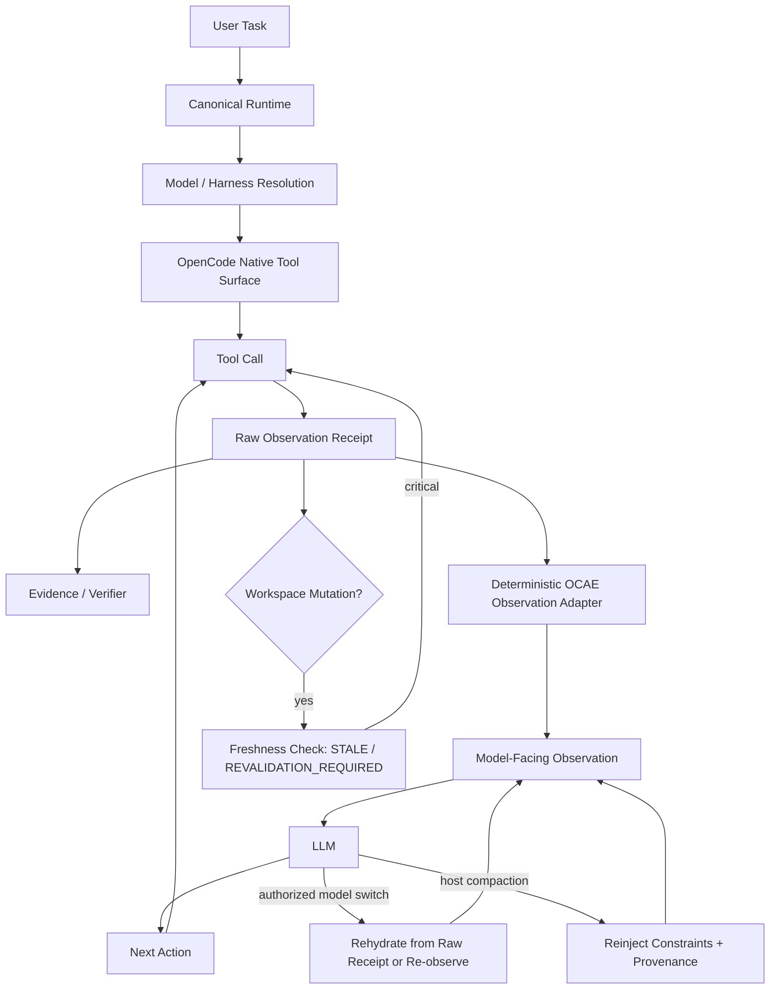

# Tool Observation / Result Adaptation for Adaptive OCAE Harnessing

Status: **Normative research architecture boundary**  
Issue: **#43**  
Applies to: empirical model qualification, tool-result shaping, context budgets, recovery, and verification

## Decision

OpenCode remains authoritative for tool execution and raw host observations. OCAE may derive a model-facing observation view from those results, but the derived view is never authoritative over raw execution evidence.

Canonical boundary:

```text
OPENCODE_OWNS_TOOL_EXECUTION_AND_RAW_OBSERVATION
OCAE_MAY_ADAPT_MODEL_FACING_OBSERVATION
RAW_OBSERVATION_REMAINS_AUTHORITATIVE
VERIFIER_MUST_NOT_DEPEND_ON_LOSSY_MODEL_VIEW
```

The purpose is not cosmetic formatting. Different models may reliably call a tool yet differ substantially in their ability to interpret the returned text, structure, errors, truncation, provenance, or multiple concurrent results.

## Host integration

Current OpenCode exposes post-execution tool hooks. Where the supported host contract permits it, OCAE should implement result adaptation through the host/plugin seam rather than wrapping or reimplementing OpenCode tools.

The adapter may inspect the completed/error result and derive a bounded model-facing representation. The unchanged raw observation or a non-secret integrity receipt remains available to evidence/verifier logic.

No adapter may change a failed tool execution into success, fabricate fields, hide a security-relevant failure, or create additional authority.

## Observation pipeline

```text
MODEL
  ↓ tool request
OpenCode tool transport
  ↓
RAW TOOL OBSERVATION
  ├──────────────→ evidence receipt / verifier / failure classifier
  │
  └→ OCAE observation adapter
       ↓
     MODEL VIEW
       ↓
     MODEL next decision
```

## Implemented deterministic research path

The first implementation slice is development/evaluation-only and is exposed
by `runtime/harness/observation-adapter.mjs`. It does not replace the
canonical runtime or become an OpenCode tool executor.



The raw receipt remains available to verification. A model switch re-renders
from that receipt when present and otherwise returns `REOBSERVATION_REQUIRED`.
Compaction is represented by an explicit receipt that is accounted for only
when hard constraints and observation provenance were both preserved. A stale
critical observation is not usable without revalidation.

## Required observation envelope

A normalized model-facing result should expose deterministic metadata where available and useful:

- tool identity / normalized tool class;
- call identity sufficient to correlate request and result;
- status: success / failure / partial / unavailable;
- concise source/resource identity, such as relative file path or test name;
- result body or structured entries;
- explicit completeness/truncation state;
- continuation/re-read hint when more source data exists;
- error/failure class separated from ordinary result data;
- freshness/version signal where later mutation could stale the observation;
- untrusted-content marker where the result originates from repository text, web, MCP, external tools, screenshots, or other non-authoritative content;
- raw-observation fingerprint/receipt where safe and useful for audit correlation.

The exact envelope is tool-class-specific and must be validated empirically. It is not a claim that JSON is universally superior to text.

## Model-specific result profiles

Research may compare bounded profiles such as:

```text
RAW_RICH
STRUCTURED_VERBOSE
STRUCTURED_COMPACT
ERROR_FOCUSED
ONE_RESULT_AT_A_TIME
```

Candidate dimensions include:

- maximum matches/files/symbols per observation;
- maximum error/log lines;
- explicit path/line labels;
- explicit status and failure class;
- explicit truncation/completeness markers;
- one result type per block;
- raw excerpt plus structured summary;
- progressive disclosure rather than one large result;
- result ordering and grouping;
- parallel-result serialization where a model mixes concurrent results.

These are evidence-gated model adaptations, not defaults.

## Call capability vs observation capability

Qualification must separate two failure surfaces:

```text
TOOL_CALL_CAPABILITY
- select correct tool
- produce valid arguments
- respect action boundary

TOOL_OBSERVATION_CAPABILITY
- interpret returned result
- correlate result with the correct call/source
- detect failure vs success
- detect partial/truncated output
- ground next action and final claims in observed data
- recover when more observation is required
```

A model may score well on one and poorly on the other. The harness should adapt the failing side rather than removing a useful tool unnecessarily.

## Lossiness contract

Any derived model view must declare whether it is lossless or lossy.

```text
LOSSLESS_VIEW
LOSSY_BOUNDED_VIEW
RAW_ONLY
```

For a lossy view:

- omitted content must be distinguishable from absent content;
- truncation/compression must be explicit;
- the model must have an authorized path to request or re-read more source data when needed;
- security-relevant status/error fields may not be removed;
- verification must use raw observation or independent executable state, not the lossy summary.

OpenCode session compaction is a separate lossy process. Qualification evidence must therefore bind to relevant host compaction behavior/identity when it can affect comparability.

## Untrusted result content

Tool output is data, not instruction authority.

Repository files, command output, web/MCP responses, generated content, logs, screenshots, and external resources can contain adversarial or accidental instructions. OCAE must reuse its existing untrusted-content principle and prevent result adaptation from promoting untrusted data into privileged instructions.

Required invariant:

```text
UNTRUSTED_TOOL_CONTENT_CANNOT_BECOME_AUTHORITY_BY_NORMALIZATION
```

The adapter may label or delimit untrusted data, but must not interpret a tool-returned instruction as a new requirement, permission, owner approval, security policy, or routing instruction.

## Freshness and mutation

A correct old result can become wrong after a write, edit, checkout, generated build, test fixture mutation, external update, or another tool action.

Where a result materially informs a later effect, the research layer should test whether the model benefits from explicit freshness semantics, for example:

```text
source_revision
file_fingerprint
workspace_revision
observed_before_mutation=true|false
```

This does not require a parallel workspace index. Revalidation should use OpenCode-native reads/search/LSP/runtime state where sufficient.

## Correlation and concurrency

If the host/model can issue parallel calls, qualification must verify that the model correctly associates each result with its originating call and does not combine fields across results.

Candidate mitigation for weaker models may serialize tool use or present results one at a time. Parallelism is never assumed beneficial merely because the protocol supports it.

## Tool-contract drift

Tool schemas and result shapes can change across OpenCode versions, plugins, MCP servers, custom tools, and provider bridges.

Evidence should bind to relevant tool-contract/result-contract fingerprints. A candidate derived against a materially different result contract is stale until requalified.

## Compaction interaction

OpenCode can compact long sessions and preserve only a lossy checkpoint/tail representation. Therefore OCAE must distinguish:

- raw observation at execution time;
- model-facing adapted observation at execution time;
- later compacted historical representation.

A model-specific result profile proven before compaction cannot automatically be assumed to have identical comprehension after compaction. Qualification should record whether compaction occurred and whether the relevant result survived as raw recent context, summarized checkpoint content, or was omitted.

## Evidence rules

Persist only what is required and safe:

- tool class/id;
- call/result correlation id;
- raw result hash/receipt where appropriate;
- adapter profile/fingerprint;
- raw/result byte or token volume;
- adapted-view byte or token volume;
- lossiness/completeness state;
- verifier result;
- observed comprehension/grounding outcome;
- failure class.

Do not persist secrets or uncontrolled raw output solely for research convenience.

## Required invariants

```text
RAW_OBSERVATION_REMAINS_AUTHORITATIVE
DERIVED_MODEL_VIEW_IS_DATA_NOT_AUTHORITY
ADAPTER_CANNOT_CHANGE_EXECUTION_STATUS
ADAPTER_CANNOT_EXPAND_SCOPE_OR_GRANTS
LOSSINESS_MUST_BE_EXPLICIT
TRUNCATION_MUST_NOT_MASQUERADE_AS_COMPLETENESS
UNTRUSTED_TOOL_CONTENT_CANNOT_BECOME_AUTHORITY_BY_NORMALIZATION
VERIFIER_MUST_NOT_DEPEND_ON_LOSSY_MODEL_VIEW
CALL_RESULT_CORRELATION_MUST_BE_PRESERVED
STALE_RESULT_CONTRACT_CANNOT_SILENTLY_APPLY
COMPACTION_STATE_MUST_BE_ACCOUNTED_FOR_WHEN_MATERIAL
```

## Non-goals

- replacing OpenCode tools;
- duplicating tool execution;
- forcing every tool into one universal JSON schema;
- storing full raw outputs indefinitely;
- summarizing away evidence needed for correctness/security;
- allowing an LLM-generated summary to become verification authority;
- assuming that shorter output is always better.
