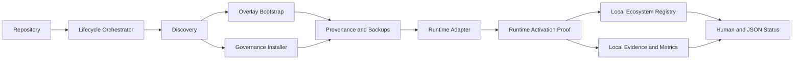

# Unified Lifecycle Architecture

`ocae` is a project-local command, not a global package or service. It first
discovers target state, then calls existing installers only for the layers that
are missing or safely updateable. Proof, registry, and metrics remain local
JSON documents with explicit schemas.

## State model

`NOT_INSTALLED`, `OVERLAY_ONLY`, `GOVERNANCE_ONLY`, and `BOTH_LAYERS` describe
installation topology. Runtime activation is independent: `NOT_INSTALLED`,
`INSTALLED_UNVERIFIED`, `HOOK_REGISTERED_UNPROVEN`, `ACTIVATION_VERIFIED`,
`RESTART_PERSISTENCE_VERIFIED`, `BYPASS_RISK`, `TOOL_GAP`, and `RED_BLOCK`.
The public primary classification remains one of `VERIFIED_IN_SCOPE`,
`NEEDS_REVIEW`, `TOOL_GAP`, or `RED_BLOCK`; the activation substatus is never
discarded.

## Data boundaries

Portable registry data contains stable project identity, repository URL, commit,
source provenance, managed hashes, verification summaries, and redacted evidence
references. Local machine references are explicitly marked local and omitted by
portable export. Metrics contain no prompt, tool output, secret, or PII fields.

## Runtime proof boundary

The proof runner can execute a deterministic adapter-host test in an isolated
temporary project. It records that scope as `isolated_test_runtime`. A real
runtime process needs separate startup, hook registration, allow/control, block
control, and restart evidence. If the current runtime cannot expose that safely,
the result is a tool gap plus an operator procedure.
